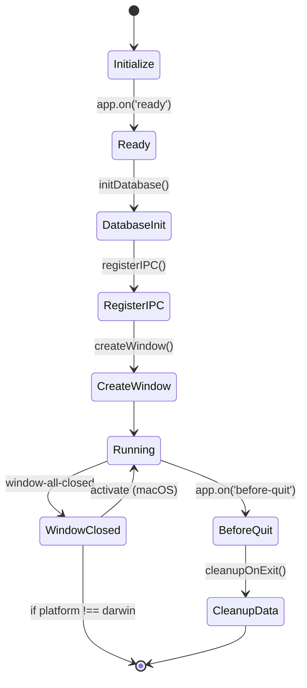

# 应用生命周期

本文档描述了 ResumeMiner 应用程序的生命周期，包括启动、运行和关闭过程。

## 应用程序生命周期图

以下状态图展示了 ResumeMiner 应用程序的生命周期：

## 启动过程

ResumeMiner 应用程序的启动过程包括以下步骤：

1. **初始化** (Initialize)：应用程序进程启动，加载必要的模块和配置。
2. **Ready 事件** (Ready)：Electron 框架初始化完成，触发 `app.on('ready')` 事件。
3. **数据库初始化** (DatabaseInit)：调用 `initDatabase()` 初始化 SQLite 数据库连接。
   - 在开发环境下，会调用 `initDatabaseData()` 初始化测试数据。
4. **注册 IPC 处理器** (RegisterIPC)：调用 `registerIPC()` 注册所有 IPC 通信处理器。
5. **创建主窗口** (CreateWindow)：调用 `createWindow()` 创建应用程序主窗口。
   - 加载 Webpack 打包的前端应用。
   - 在开发环境下，打开开发者工具。
6. **运行** (Running)：应用程序进入正常运行状态。

## 运行过程

在正常运行状态下，应用程序会：

- 响应用户界面交互
- 处理 IPC 消息
- 执行数据库操作
- 管理窗口状态

## 关闭过程

应用程序的关闭过程包括以下步骤：

1. **窗口关闭** (WindowClosed)：用户关闭所有窗口，触发 `window-all-closed` 事件。
   - 在 macOS 上，关闭所有窗口不会退出应用，应用程序保持在 Dock 中。
   - 在其他平台上，关闭所有窗口会触发应用程序退出。
2. **退出前处理** (BeforeQuit)：触发 `app.on('before-quit')` 事件。
3. **数据清理** (CleanupData)：调用 `cleanupOnExit()` 进行数据清理。
   - 在开发环境下，会清空 Resume 数据。
4. **应用退出**：应用程序进程结束。

## 特殊处理

- **SIGINT 信号**：当用户按下 Ctrl+C 时，应用程序会捕获 SIGINT 信号，并进行数据清理后退出。
- **macOS 专有行为**：在 macOS 上，点击 Dock 图标时，如果没有窗口打开，会重新创建窗口。
