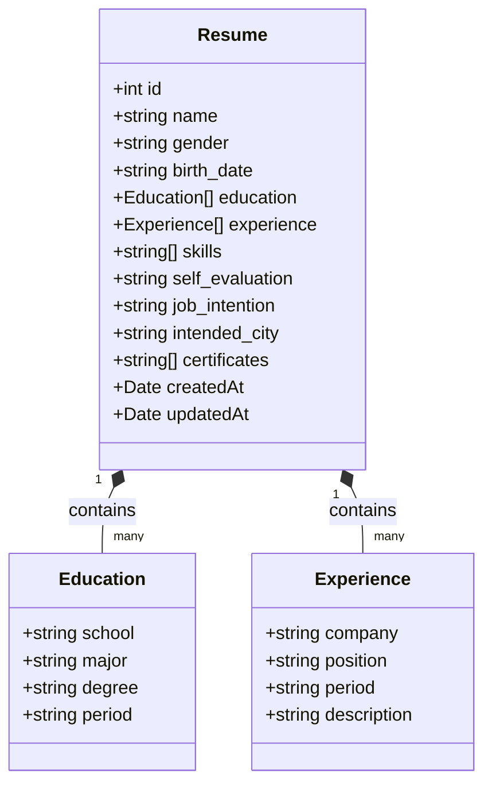

# 数据库架构

本文档描述了 ResumeMiner 应用程序的数据库架构设计。

## 实体关系图

ResumeMiner 使用 SQLite 数据库存储简历相关数据。主要实体及其关系如下图所示：

## 实体描述

### Resume (简历)

简历是应用程序的核心实体，包含求职者的所有相关信息。

| 字段名          | 类型     | 描述         |
| --------------- | -------- | ------------ |
| id              | integer  | 主键，自增   |
| name            | string   | 姓名         |
| gender          | string   | 性别         |
| birth_date      | string   | 出生日期     |
| education       | json     | 教育经历数组 |
| experience      | json     | 工作经验数组 |
| skills          | string[] | 技能列表     |
| self_evaluation | text     | 自我评价     |
| job_intention   | string   | 求职意向     |
| intended_city   | string   | 意向城市     |
| certificates    | string[] | 证书列表     |
| createdAt       | datetime | 创建时间     |
| updatedAt       | datetime | 更新时间     |

### Education (教育经历)

教育经历作为 JSON 对象存储在 Resume 实体中。

| 字段名 | 类型   | 描述     |
| ------ | ------ | -------- |
| school | string | 学校名称 |
| major  | string | 专业     |
| degree | string | 学位     |
| period | string | 时间段   |

### Experience (工作经验)

工作经验作为 JSON 对象存储在 Resume 实体中。

| 字段名      | 类型   | 描述     |
| ----------- | ------ | -------- |
| company     | string | 公司名称 |
| position    | string | 职位     |
| period      | string | 时间段   |
| description | string | 工作描述 |

## 数据库初始化

数据库使用 TypeORM 进行初始化和管理。应用程序启动时会自动创建数据库表结构，并在开发环境下初始化测试数据。
