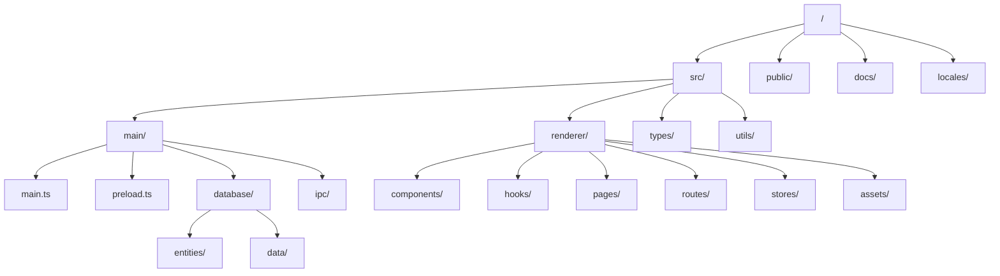

# 目录结构

本文档描述了 ResumeMiner 应用程序的目录结构和文件组织。

## 项目目录结构图

以下是 ResumeMiner 项目的主要目录结构图：

## 目录说明

### 顶级目录

- **src/**: 源代码目录
- **public/**: 静态资源目录
- **docs/**: 文档目录
- **locales/**: 国际化资源目录

### src/ 目录

- **main/**: Electron 主进程代码
- **renderer/**: Electron 渲染进程代码（React 应用）
- **types/**: TypeScript 类型定义
- **utils/**: 通用工具函数

### main/ 目录

- **main.ts**: 应用程序入口文件
- **preload.ts**: 预加载脚本
- **database/**: 数据库相关代码
- **ipc/**: IPC 通信相关代码

### database/ 目录

- **entities/**: 数据库实体定义
- **data/**: 示例数据

### renderer/ 目录

- **components/**: React 组件
- **hooks/**: React 自定义 Hooks
- **pages/**: 页面组件
- **routes/**: 路由配置
- **stores/**: 状态管理
- **assets/**: 静态资源（图片、样式等）

## 关键文件说明

### 主进程文件

- **main/main.ts**: 应用程序主入口，负责初始化应用程序、创建窗口等。
- **main/preload.ts**: 预加载脚本，用于安全地暴露 API 给渲染进程。
- **main/database/index.ts**: 数据库初始化和管理。
- **main/ipc/index.ts**: IPC 处理器注册和实现。
- **main/ipc/channels.ts**: IPC 通道定义。

### 渲染进程文件

- **renderer/App.tsx**: React 应用入口组件。
- **renderer/index.tsx**: React 应用入口点。
- **renderer/layouts/MainLayout.tsx**: 主布局组件。
- **renderer/pages/Home/index.tsx**: 首页组件。
- **renderer/pages/Resume/Detail.tsx**: 简历详情页组件。
- **renderer/hooks/useElectron.ts**: 封装 Electron API 的 Hook。
- **renderer/routes/config.ts**: 路由配置。

### 构建配置文件

- **webpack.main.config.ts**: 主进程 Webpack 配置。
- **webpack.renderer.config.ts**: 渲染进程 Webpack 配置。
- **forge.config.ts**: Electron Forge 配置。
- **tsconfig.json**: TypeScript 配置。
