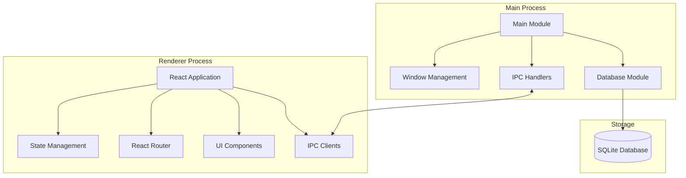

# 高级系统架构

本文档描述了 ResumeMiner 应用程序的高级系统架构。

## 系统组件概述

ResumeMiner 是一个基于 Electron 的桌面应用程序，用于管理和分析简历数据。应用程序采用 Electron 的主进程/渲染进程架构，使用 React 作为 UI 框架，SQLite 作为数据存储。

## 主要组件说明

### 主进程 (Main Process)

- **Main Module**: 应用程序的入口点，负责初始化应用程序和管理窗口。
- **Database Module**: 负责数据库连接和数据访问。
- **IPC Handlers**: 处理来自渲染进程的 IPC 请求。
- **Window Management**: 管理应用程序窗口的创建和生命周期。

### 渲染进程 (Renderer Process)

- **React Application**: 基于 React 的 UI 应用程序。
- **IPC Clients**: 与主进程通信的客户端。
- **UI Components**: 可重用的 UI 组件。
- **React Router**: 负责应用程序内的页面路由。
- **State Management**: 管理应用程序状态。

### 存储 (Storage)

- **SQLite Database**: 本地 SQLite 数据库，用于存储简历数据。

## 技术栈

- **Electron**: 跨平台桌面应用程序框架
- **React**: 用户界面库
- **TypeScript**: 编程语言
- **SQLite**: 本地数据库
- **TypeORM**: 对象关系映射库
