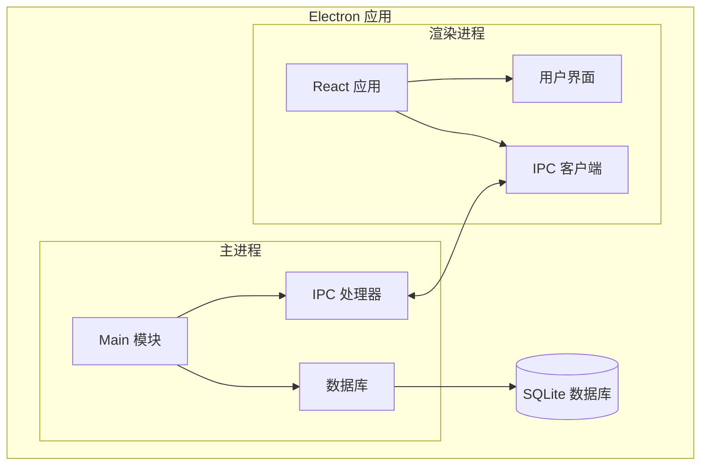

# ResumeMiner 系统架构文档

欢迎查阅 ResumeMiner 应用程序的系统架构文档。本文档提供了系统设计的概述，并链接到详细的架构文档。

## 文档概述

ResumeMiner 是一个基于 Electron 和 React 的桌面应用程序，用于管理和分析简历数据。本架构文档涵盖了应用程序的主要组件、通信机制、数据模型和生命周期。

## 文档导航

以下是 ResumeMiner 系统架构文档的主要部分：

1. [高级系统架构](./high-level-architecture.md) - 系统组件概述和交互
2. [数据库架构](./database-schema.md) - 数据库结构和实体关系
3. [IPC 通信流程](./ipc-communication.md) - 主进程和渲染进程之间的通信
4. [应用生命周期](./application-lifecycle.md) - 应用程序的启动、运行和关闭过程
5. [目录结构](./directory-structure.md) - 项目文件和目录的组织

## 系统架构图（概览）

下图展示了 ResumeMiner 应用程序的高级架构概览：

