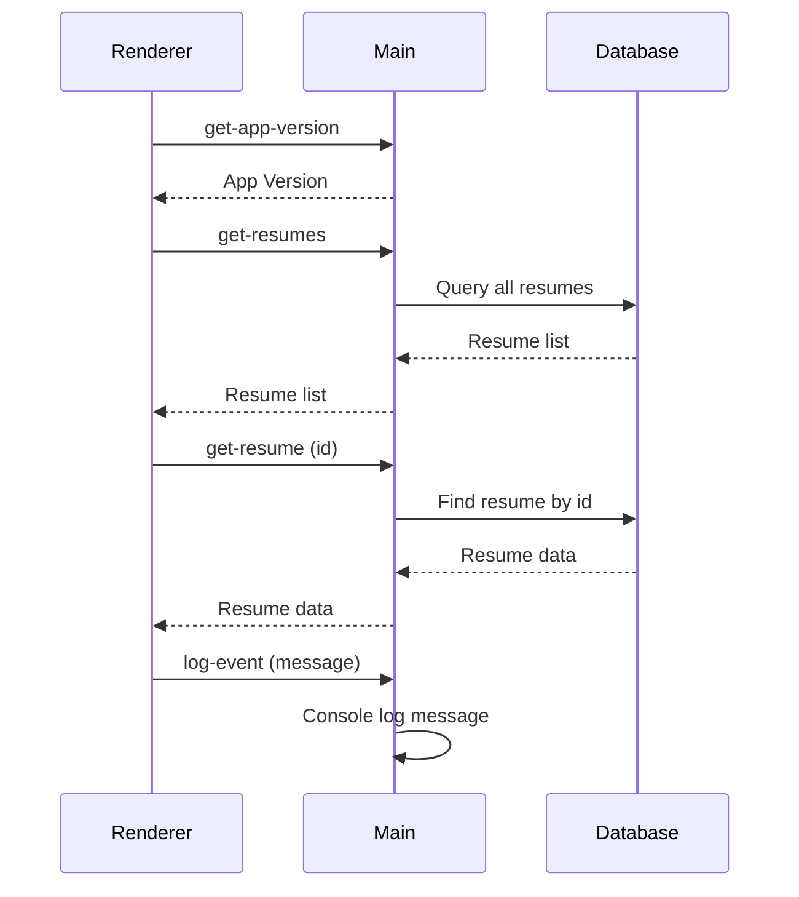

# IPC 通信流程

本文档描述了 ResumeMiner 应用程序中主进程和渲染进程之间的 IPC 通信流程。

## IPC 通道概述

Electron 应用程序中，主进程和渲染进程通过 IPC (Inter-Process Communication) 通道进行通信。在 ResumeMiner 中，IPC 通道主要用于以下功能：

1. 获取应用程序版本信息
2. 获取简历数据
3. 管理简历数据（保存、更新、删除）
4. 日志记录

## 通信流程图

以下流程图展示了主要的 IPC 通信流程：

## IPC 通道定义

### 主进程通道 (IPCMainChannels)

主进程通道用于渲染进程向主进程发送请求。

| 通道名称        | 说明             | 参数        | 返回值   |
| --------------- | ---------------- | ----------- | -------- |
| get-app-version | 获取应用程序版本 | 无          | string   |
| get-resumes     | 获取所有简历     | 无          | Resume[] |
| get-resume      | 获取单个简历     | id: string  | Resume   |
| save-resume     | 保存新简历       | Resume 对象 | Resume   |
| update-resume   | 更新简历         | Resume 对象 | Resume   |
| delete-resume   | 删除简历         | id: string  | boolean  |
| refresh-skills  | 刷新技能列表     | 无          | string[] |

### 渲染进程通道 (IPCRendererChannels)

渲染进程通道用于主进程向渲染进程发送事件。

| 通道名称  | 说明     | 参数            |
| --------- | -------- | --------------- |
| log-event | 日志记录 | message: string |

## IPC 处理器实现

IPC 处理器在主进程中实现，用于处理来自渲染进程的请求。主要处理器包括：

- `handleGetAppVersion`: 获取应用程序版本
- `handleGetResumes`: 获取所有简历
- `handleGetResume`: 获取单个简历
- `handleLogEvent`: 处理日志事件

所有 IPC 处理器在应用程序启动时通过 `registerIPC` 函数注册。

## 渲染进程 IPC 客户端

渲染进程通过 `useElectron` Hook 提供的接口与主进程通信。该 Hook 封装了 IPC 通信的细节，提供了简单的接口供组件使用。
